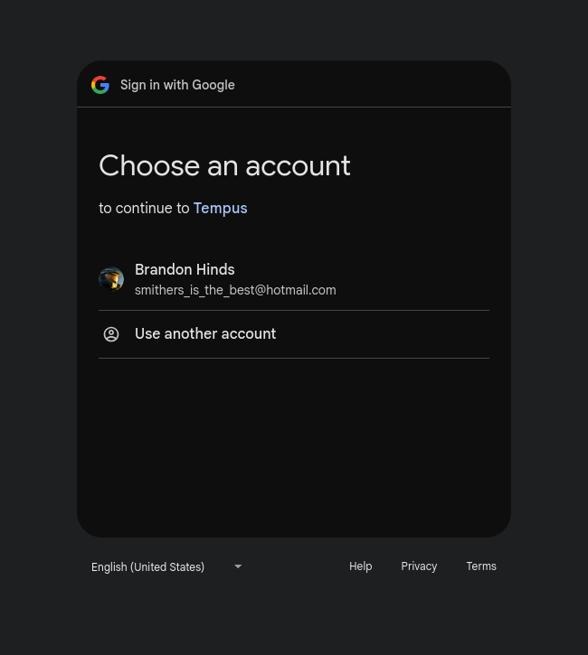
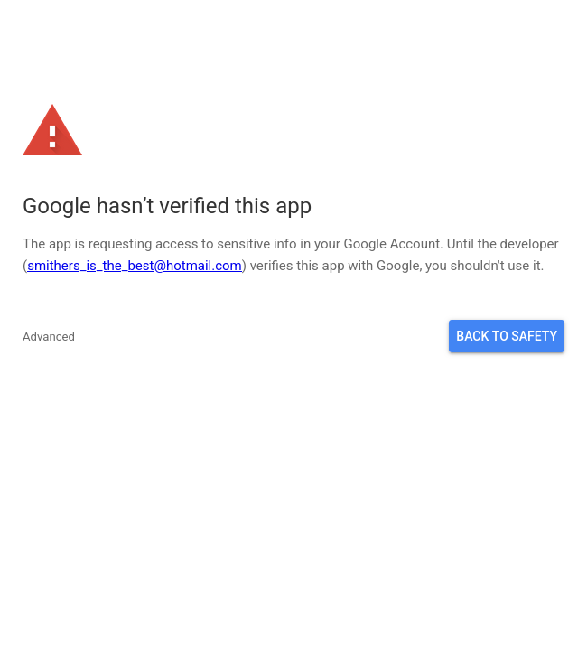
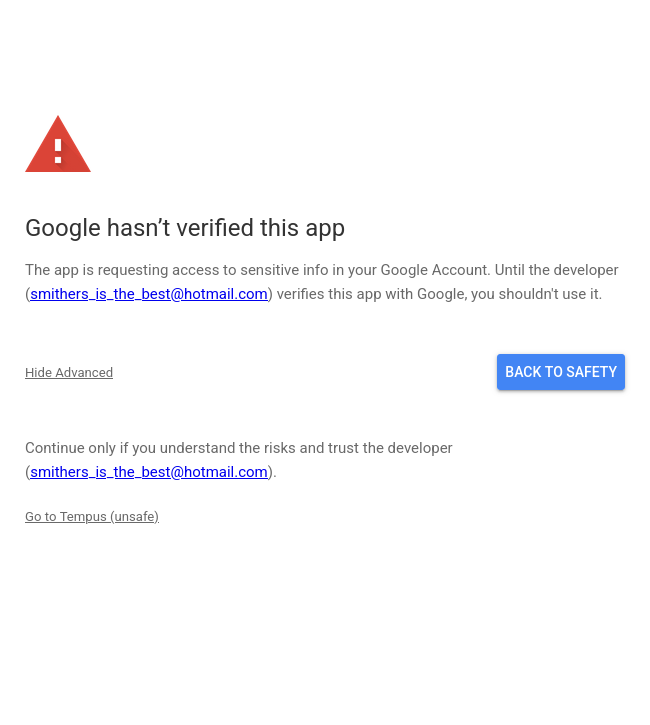
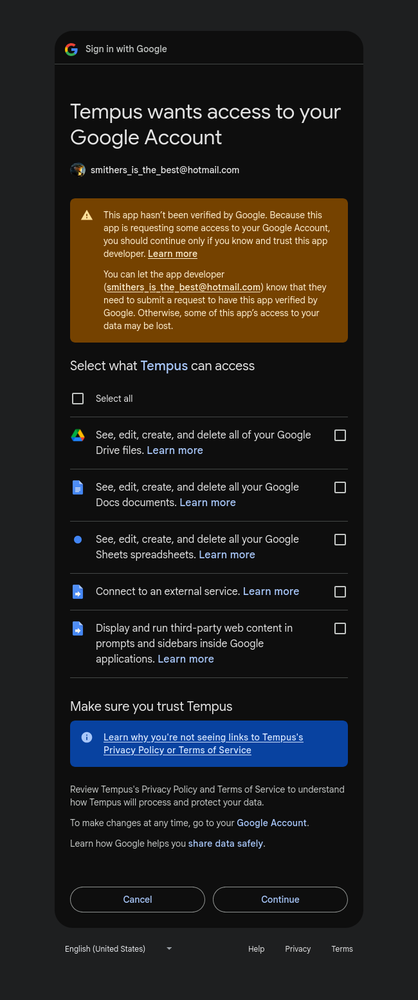
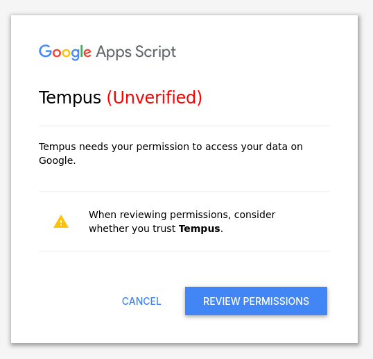
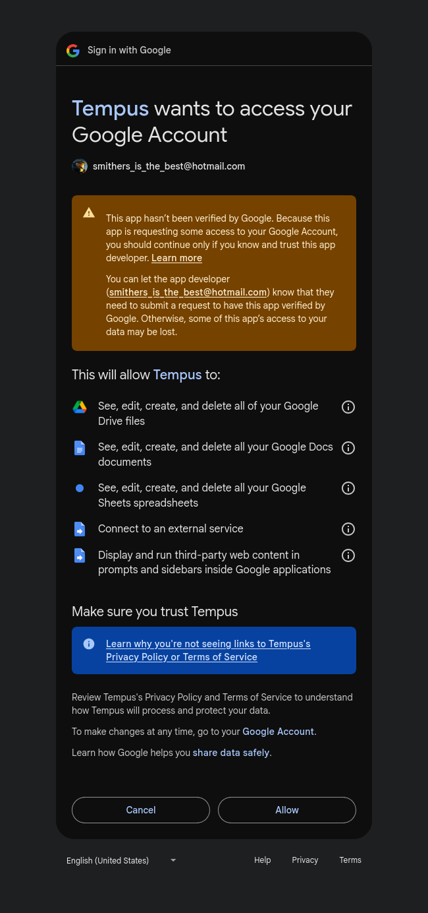

# Getting Started with Tempus

A comprehensive timesheet application that tracks your hours, calculates income, and manages contracts using Google Sheets as your personal database.

## Purpose
Tempus is a desktop-first timesheet application designed for contractors, consultants, and employees who need precise time tracking with sophisticated income calculations. Every installation runs independently on your own Google Drive, ensuring complete data privacy and control.

## What Tempus Is

Tempus combines the familiarity of Google Sheets with a powerful web interface:
- **Desktop-first web application**: Optimised for desktop browsers with full keyboard navigation.
- **Google Sheets backend**: All your data lives in a spreadsheet on your Google Drive that you own and control.
- **Single-user by design**: Each installation is completely independent. No shared databases or multi-user complexity.
- **Performance-focused**: Heavy use of browser caching and optimistic UI updates ensure fast, responsive interactions.
- **Apps Script powered**: Google Apps Script serves data from your sheets to a vanilla JavaScript interface.

## What You'll Track

### Time Entries
Record your working hours using two modes:
- **Basic mode**: Simple total hours entry (e.g., "7.5 hours on 15 Jan 2025")
- **Advanced mode**: Punch in/out times with automatic duration calculation

### Contracts
Define your engagements with:
- Date ranges and hourly rates
- Optional hour caps with burndown tracking
- Multiple concurrent contracts supported

### Income Calculations
Automatic calculations for:
- Gross and net income
- Superannuation (employer guarantee + extra contributions)
- Tax withholding (Australian tax tables)
- Pre-tax deductions (salary sacrifice)
- Company income and expenses (when company tracking is enabled)

### Optional Features (Feature Flags)
Enable as needed:
- Hour types (categorise time as work, leave, training, etc.)
- Deductions and categories
- Invoicing and BAS reporting
- Payroll helpers for Xero and MYOB
- Recurring and bulk time entries
- And many more...

See [Feature Flags Reference](feature-flags.md) for the complete list.

## First-Time Setup

Follow these steps to get Tempus running for the first time.

### Step 1: Allow Permissions

When you first run Tempus, Google will prompt you to grant permissions.

1. A dialog will say a script needs your permission to run. Click **Review permissions**.

2. In the **Choose an account** window, select your Google account.

3. In the **Google hasn’t verified this app** window, click **Advanced**, then **Go to Tempus (unsafe)**.

4. In the **Tempus wants to access your Google Account** window, review the permissions (see *Why these permissions?* below), click the *Select All* option, then scroll down and click **Continue**.

5. Return to the Google Sheet and follow the instructions in the INTRO sheet to get the Tempus URL.

**Why these permissions?**
Tempus needs access to the spreadsheet to read and write your time entries, contracts, and settings. The web content permission allows the interface to load and pull data for public holidays. **None of your data is sent externally - the creator of Tempus has no interest in how much money you make!**

The Google Drive access allows the sheet to read and write files to your Google Drive (such as reading Timesheet 1.0 sheets and writing invoices). This permssion *may* be optional if you don't use these features, but it has not been tested.

### Step 2: Get the Tempus URL

After granting permissions, you need the test deployment URL.

1. Open the Apps Script editor (Extensions → Apps Script from your spreadsheet).
2. Click **Deploy** → **Test deployments**.
3. Copy the **Web app URL** shown.
4. Bookmark this URL in your browser - this is your Tempus application.

**Development URL tip:** The URL will look like `https://script.google.com/macros/s/.../dev`. Despite being the development URL it is recommended this be the permanent Tempus URL, as it makes updating significantly easier. Bookmark this.

### Step 3: Load Tempus

1. Open the web app URL you copied in Step 2.
2. You will again be prompted to grant Tempus permissions. Click the *Review Permissions* button.

3. Most of this process is the same as *Step 1: Allow Permissions* section above, with the only difference being the way you accept the permissions (this time you just click *Allow* at the bottom of the window).

4. The Tempus interface loads with the Time Entry page as the default view.
5. You'll see a mostly empty interface - this is expected for a fresh installation.

**What you'll see:**
- Time Entry form (Basic and Advanced tabs)
- Empty calendar for the current month
- Navigation menu in the header
- No entries, contracts, or data yet

### Step 4: Create Your First Contract

Before you can log any time, you need at least one contract.

1. Click **Contracts** in the main navigation menu.
2. Click the **Add Contract** button in the toolbar.
3. Fill in the required fields:
   - **Contract Name**: Descriptive name (e.g., "Acme Corp Consulting", "Full-time Employment")
   - **Start Date**: When this contract begins
   - **Hourly Rate**: Your total package rate in dollars per hour (include super and benefits)
4. Optional fields:
   - **End Date**: Leave blank for ongoing contracts
   - **Total Hours**: Set a cap if this is a fixed-hour contract
   - **Standard Hours Per Day**: Defaults to 7.5 (adjust if needed)
5. Click **Save**.
6. Your contract appears in the dropdown and is ready for time entries.

**Why contracts matter:** Every time entry must reference a valid contract. Contracts define your rates and are used for all income calculations.

See [Contracts documentation](contracts.md) for details.

### Step 5: Configure Core Settings

Customise Tempus to match your situation.

1. Click **Settings** in the main navigation menu.
2. Scroll to the **Core** section (it's expanded by default).
3. Review and update these essential settings:

#### Financial Year Start Month
- **Default:** July (Australian financial year)
- **Options:** Any month
- **When to change:** If you're in a different country or use a calendar year (January)

#### Tax-Free Threshold
- **Default:** Enabled
- **What it does:** Claims the tax-free threshold when calculating tax withholding
- **When to disable:** If you have multiple jobs and are claiming the threshold elsewhere

#### Tax Rate Type
- **Default:** Fortnightly
- **Options:** Weekly, fortnightly, monthly
- **What it does:** Determines which tax table to use for withholding calculations
- **Set this to:** Your actual pay frequency

#### Superannuation Guarantee Rate
- **Default:** 11.5% (current Australian super guarantee rate as of 2024)
- **What it does:** Percentage used to calculate employer super contributions
- **When to change:** When the ATO updates the super guarantee rate

#### Theme
- **Default:** Dark
- **Options:** Dark, Light, High Contrast Dark, High Contrast Light, Custom (when enabled)
- **What it does:** Changes the colour scheme of the interface
- **Set this to:** Your preferred theme

4. Click **Save Settings** at the bottom of the page.

**Settings are flexible:** You can return to Settings at any time to adjust these values. Many additional settings appear when you enable feature flags.

See [Settings documentation](settings.md) for complete details.

## Next Steps

You're now ready to use Tempus! Here's what to do next:

### Start Logging Time

1. Navigate to **Time Entry** (or **Dashboard & Calendar**).
2. Select today's date (or click a day on the calendar).
3. Choose your contract from the dropdown.
4. Enter your hours:
   - **Basic mode**: Enter total hours (e.g., 7.5)
   - **Advanced mode**: Punch in and out with specific times
5. Click **Add Entry**.
6. Your time appears on the calendar and income calculations update automatically.

See [Dashboard & Calendar documentation](dashboard-calendar.md) for details.

### Explore the Interface

- **Calendar**: Click any day to view or edit entries for that date.
- **Income badge**: Click to expand the full income breakdown with superannuation, tax, and deductions.
- **Month navigation**: Use the arrows to move between months.
- **Annual Views**: See yearly summaries and trends (accessible from the main menu).

### Enable Feature Flags

Tempus includes many optional features that are disabled by default. Enable them as needed:

1. Navigate to **Settings**.
2. Scroll to the **Feature Flags** section.
3. Review the available flags organised into groups:
   - **Income**: Deductions, actual income tracking, rate preview
   - **Time Entries**: Hour types, bulk operations, payroll helpers
   - **Company**: Invoicing, BAS reporting, company tracking
   - **Utilities**: Interface preferences
   - **Accessibility**: Themes and colour-blind support
4. Click the toggle next to any flag to enable it.
5. Explore the new features that appear.

**Recommended flags to explore:**
- **Enable multiple hour types**: If you track different categories of time (work, leave, training)
- **Enable default hours for time entries**: If you frequently log the same hours and want quick entry
- **Enable actual income tracking**: If you want to compare estimated vs actual income
- **Enable company income tracking**: If you run a business and need to track company-level finances

See [Feature Flags Reference](feature-flags.md) for complete details on every flag.

### Experiment with Features

- **Create hour types**: If you enabled hour types, visit the Hour Types page to create categories.
- **Add deductions**: If you have salary sacrifice or business expenses, add them on the Deductions page.
- **Explore annual views**: Check the Annual Views page to see yearly trends (even with just a few entries).
- **Customise your theme**: Try different themes in Settings to find your preferred look.

### Get Help

- **Documentation**: Every feature has detailed documentation. Use the links throughout the app and in [docs/README.md](README.md).
- **Feature flags**: If a button or page is missing, check if it requires a feature flag to be enabled.
- **Cache issues**: If the UI seems stale after manual spreadsheet edits, enable the **Show clear cache button** flag and use it to refresh.

## Where Things Live

Understanding Tempus's architecture helps when troubleshooting or customising:

### Your Data
All data lives in Google Sheets tabs within your Tempus spreadsheet:
- **timesheet_entries**: Your logged hours with punch times
- **contracts**: Contract definitions with rates and dates
- **user_settings**: Your settings and preferences
- **feature_flags**: Enabled/disabled state of optional features
- **deductions**: Salary sacrifice and company expenses (when enabled)
- **invoices**: Invoice records (when invoicing is enabled)
- And more...

See [sheetSchemas.md](../sheetSchemas.md) (developer reference) for complete schema details.

### The Code
If you're curious about the implementation:
- **Backend**: `backend/*.gs` files contain Apps Script functions that read/write sheets
- **Frontend**: `views/partials/*.html` files contain the interface components
- **Main template**: `views/index.html` assembles the full application

### The Cache
Tempus caches data in browser local storage for performance:
- **What's cached**: Entries, contracts, settings, hour types, deductions, invoices
- **Why caching matters**: Dramatically improves load times and responsiveness
- **Cache status**: The status badge in the header shows the current cache state
- **Clearing cache**: Enable the **Show clear cache button** flag in Settings if you need to manually clear

See [Cache Management documentation](cache.md) for details.

## Common First-Time Questions

### Do I need to understand Google Sheets?
No. Tempus provides a complete interface - you never need to open the spreadsheet directly. The sheets are just the storage layer.

### Can I edit the spreadsheet directly?
Yes, but it's not recommended. Use the Tempus interface for all normal operations. Direct sheet edits bypass validation and caching, potentially causing issues.

### Can multiple people use the same installation?
Yes, if required. Tempus is single-user by design. Each person should have their own copy with their own data. However, if you want to grant someone else access to your Tempus instance (e.g. you and your partner both need access to the information) then you can share the sheet with them and they will be able to access the front end after logging in with their Google account.

### What happens to my data if I stop using Tempus?
Your data remains in the Google Sheets spreadsheet forever. You can export it, back it up, or use it with other tools. You own it completely.

### How do I back up my data?
Use the backup feature on the About page, or simply make a copy of the spreadsheet in Google Drive. The spreadsheet contains all your data.

### Can I use Tempus offline?
No. Tempus requires an internet connection to access Google Sheets and Apps Script.

### Is my data secure?
Yes. Your data lives on your Google Drive, protected by your Google account security. The application code runs in your Google Apps Script environment. Nothing is sent to external servers.

### How do I update Tempus?
See [Updates documentation](updates.md) for the complete update process. The About page provides an automated update script.

## Tips for New Users

- **Start simple**: Begin with basic time entry and a single contract. Enable features gradually as you need them.
- **Bookmark the URL**: Save your web app URL as a bookmark for easy access.
- **Use feature flags liberally**: Don't be afraid to enable a flag, try the feature, and disable it if you don't need it.
- **Check the documentation**: When you're unsure how something works, look for the documentation link in the interface or visit [docs/README.md](README.md).
- **Review settings periodically**: As tax rates and super guarantee rates change, update your settings to keep calculations accurate.
- **Understand contracts**: Contracts are the foundation of Tempus. Make sure your contract rates include your full package (gross income + super).
- **Trust the cache**: The cache makes Tempus fast. Only clear it if something seems wrong - most of the time it "just works".
- **Mobile support**: Tempus is desktop-first but includes a mobile entry view for quick entries on phones. See [Mobile Entry documentation](mobile-entry.md).

## Next Documentation to Read

1. [Dashboard & Calendar](dashboard-calendar.md) - Learn the primary time entry interface
2. [Contracts Management](contracts.md) - Understand how to manage your engagements
3. [Feature Flags Reference](feature-flags.md) - Explore available optional features
4. [Settings Page Guide](settings.md) - Configure Tempus to match your situation
5. [Cache Management](cache.md) - Understand how caching works and when to clear it

## Summary

Tempus is a Google Sheets-powered timesheet application for tracking hours, calculating income, and managing contracts. Grant permissions, deploy the web app, create your first contract, configure core settings, and start logging time.
